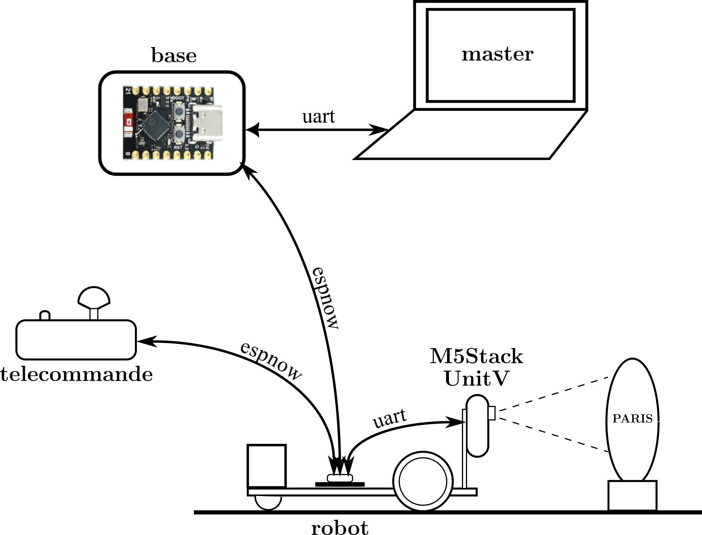

# Developpement pour le Robot Service Jeunesse 2025

 
   

## Fonctionnement

- télécommande : elle lit la position du joystick, la transcrit en commande de vitesse des deux moteurs
  et envoie cette commande au robot à une fréquence de 10 Hz.

- M5Stack UnitV (K210) : 
  
