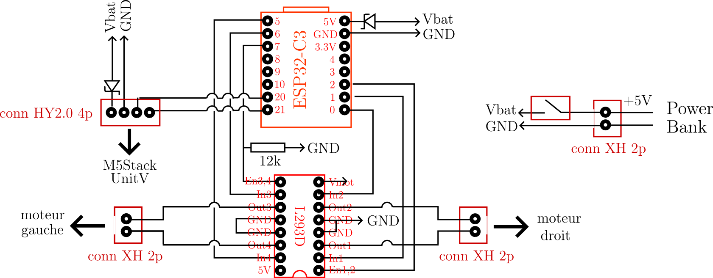
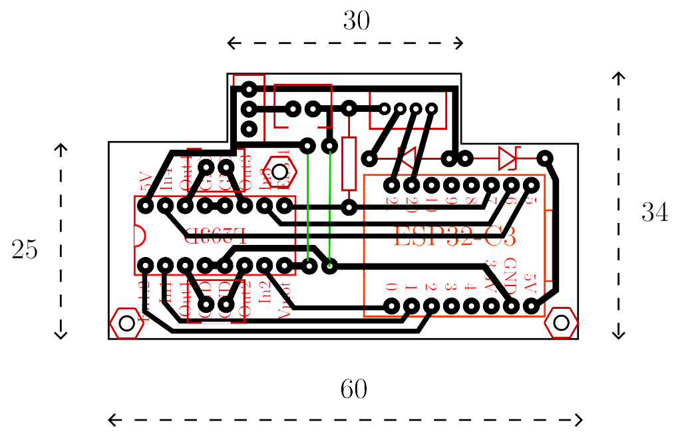

## Développement robot

Les fichiers de pcb contenus dans ce répertoire sont ceux du prototype

Pour le pcb définitif, voir le répertoire **Kicad_9.0**

### Schéma électrique

 
   

  ### PCB

 
  

